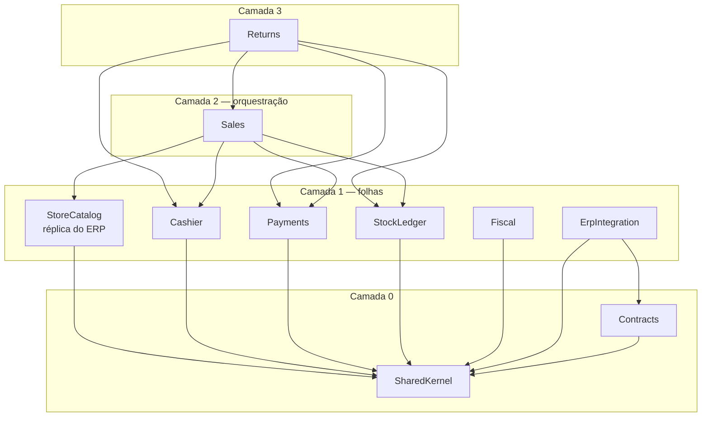

# ADR-0022 — Grafo de dependência entre módulos

**Status:** Proposto · **Data:** 2026-09-30
**Detalha:** [ADR-0001](ADR-0001-modulos-por-contexto.md) · [ADR-0020](ADR-0020-escopo-pdv-multi-erp.md)

## Contexto

O [ADR-0001](ADR-0001-modulos-por-contexto.md) estabeleceu módulos por bounded context,
schema próprio e comunicação por interface pública ou evento. Não disse **quem referencia
quem**.

Sem esse grafo escrito, a dependência é decidida caso a caso por quem estiver
implementando, e o resultado conhecido é: ciclos, um módulo "utilitário" que todo mundo
referencia, e fronteiras que existem só no diagrama.

## Decisão

### Regras que produzem o grafo

1. **Um assembly por módulo.** Sem isso, `internal` não significa nada e a fronteira é
   convenção de pasta. Com isso, o compilador recusa a violação.
2. **Sem ciclos.** Um assembly por módulo já torna o ciclo impossível de compilar.
3. **Referência entre módulos é por `id`, nunca por tipo.** `Payments` guarda
   `reference_id` + `reference_kind`, não uma referência ao agregado `Sale`.
4. **Evento é o padrão; referência direta é a exceção**, justificada apenas por
   "necessário de forma síncrona, na mesma transação".
5. **Cada módulo expõe um único namespace público** (`<Modulo>.Abstractions`) com
   interfaces e DTOs. Todo o resto é `internal`.

### O grafo

### Quem referencia quem, e por quê

| Módulo | Referencia | Por quê |
|---|---|---|
| **SharedKernel** | — | `Money`, `StoreId`, `TenantId`, `Cpf`, `Quantity`, `Result`. Zero regra de negócio de qualquer contexto |
| **Contracts** | SharedKernel | Eventos versionados. Carregam value objects |
| **StoreCatalog** | SharedKernel | Réplica de produto e preço vinda do ERP. Somente leitura, folha por natureza |
| **Cashier** | SharedKernel | Sessão de caixa não precisa conhecer venda. A dependência é no sentido oposto |
| **Payments** | SharedKernel | Guarda `reference_id` + `reference_kind`, não o agregado que originou |
| **StockLedger** | SharedKernel | Idem: movimento aponta para uma referência opaca |
| **Fiscal** | SharedKernel | Recebe um `FiscalDocumentRequest` neutro. **Não conhece Sale nem Return** |
| **ErpIntegration** | SharedKernel, Contracts | **Só isso** — ver abaixo |
| **Sales** | + StoreCatalog, Cashier, StockLedger, Payments | É o orquestrador: resolve item e preço, valida sessão aberta, grava movimento e pagamento na mesma transação |
| **Returns** | + Sales, StockLedger, Payments, Cashier | Precisa dos itens da venda original para validar quantidade devolvida |

## Por quê

### Fiscal não é referenciado por ninguém

Parece contraintuitivo, já que emitir documento é central. Mas **Fiscal atende Sales e
Returns**. Se ele dependesse de `Sale`, `Returns` teria de passar por `Sales` para emitir
uma nota de devolução — acoplamento artificial entre dois contextos que não têm relação de
dependência real.

Ele recebe um pedido neutro e é alcançado **por evento**. Na cloud isso é natural: a NFC-e
já foi emitida no Edge ([ADR-0006](ADR-0006-fiscal-contexto-isolado.md)) e o `Sales` só
registra chave e protocolo; a NF-e de devolução é assíncrona e ninguém espera por ela.

### ErpIntegration toca em tudo e não referencia quase nada

É o resultado mais importante deste grafo. O conector lê venda, devolução e fechamento de
caixa, e escreve catálogo, preço e estoque. Pela intuição, dependeria de seis módulos — e
viraria um segundo orquestrador, com alcance largo e risco de ciclo.

Não depende, porque **conversa inteiramente por evento**:

- **Entrada:** o conector grava o lote em object storage e publica um evento com o
  ponteiro. `StoreCatalog` consome e faz a carga
  ([ADR-0015](ADR-0015-import-copy-staging.md)). A dependência fica invertida — quem
  conhece o formato do destino é o destino.
- **Saída:** `Sales` publica `SaleCompleted.v1`; o conector consome.

Isso é o que mantém a camada de anticorrupção honesta
([ADR-0021](ADR-0021-erp-connector-anticorrupcao.md)). Se ela referenciasse os módulos de
domínio, o modelo do ERP teria caminho direto para dentro deles.

### Por que o payload não trafega pelo broker

Um catálogo de milhões de itens não passa por fila. O evento carrega um ponteiro; o dado
vai por object storage. Mantém o broker leve e a dependência invertida ao mesmo tempo.

### Sales é o único módulo com muitas dependências — e tudo bem

Orquestrador depende das peças; as peças não conhecem o orquestrador. Isso é dependência
apontando para a estabilidade: `Sales` é o módulo que mais muda e o que menos gente
referencia. `StoreCatalog` é o que menos muda e o mais referenciado.

## Alternativas descartadas

- **Inverter `Returns → Sales` via DIP** (Returns define `IReturnableItemsProvider`, Sales
  implementa, composition root conecta). Removeria a dependência de compilação e deixaria
  os dois na mesma camada. **Rejeitada:** devolução sem venda não existe — o acoplamento é
  de domínio, real, não acidental. Inverter seria cerimônia que esconde uma relação
  verdadeira. Reconsiderar apenas se `Returns` for extraído em serviço separado.
- **Um módulo `Common` com utilitários.** Rejeitada categoricamente: vira o depósito onde
  todo mundo põe o que não sabe onde colocar, e como todos dependem dele, qualquer mudança
  recompila o mundo. `SharedKernel` tem escopo fechado — value objects, sem comportamento
  de contexto.
- **Tudo por evento, inclusive Sales → Cashier.** Rejeitada: validar sessão aberta precisa
  ser síncrono e bloquear a venda ([ADR-0018](ADR-0018-sessao-de-caixa.md)). Evento daria
  consistência eventual onde é preciso invariante.
- **Módulos no mesmo assembly, separados por pasta.** Rejeitada: `internal` vazaria e a
  regra dependeria só de teste de arquitetura. Com assemblies separados, o compilador
  recusa antes do teste rodar.

## O Store Edge compartilha o quê

O Edge é outro deployable, com SQLite e um mundo de uma loja só. **Compartilha o domínio,
não a infraestrutura:**

| Compartilhado | Por quê |
|---|---|
| `SharedKernel` | Value objects idênticos dos dois lados |
| `Contracts` | Fala o mesmo protocolo com a cloud |
| `Fiscal.Core` — montador de XML + assinador | [ADR-0006](ADR-0006-fiscal-contexto-isolado.md) exige **uma** implementação: duas divergiriam |
| Invariantes dos agregados | Mesma regra de venda e de caixa nos dois lados |

**Não compartilha** repositórios, migrações nem configuração de persistência: EF Core sobre
PostgreSQL de um lado, SQLite do outro.

## Consequências

**Positivas**
- Ciclo é erro de compilação, não achado de revisão.
- `ErpIntegration` isolado por construção: o modelo de nenhum ERP alcança o domínio.
- A ordem de implementação cai do grafo: camada 0 → 1 → 2 → 3.

**Negativas**
- **Um assembly por módulo aumenta o tempo de build** e enche a solution. É o preço de ter
  `internal` com significado.
- Referência por `id` em vez de tipo **abre mão de integridade referencial no compilador**.
  Um `reference_id` apontando para nada não é erro de compilação — precisa de validação e
  de teste.
- Comunicação por evento entre `ErpIntegration` e os módulos torna o rastreio mais
  difícil: não há chamada para seguir no depurador. Depende de trace distribuído
  ([ADR-0013](ADR-0013-observabilidade-otlp.md)) para reconstruir o fluxo.
- `Returns → Sales` é o único ponto onde um módulo depende do orquestrador. Se `Returns`
  crescer, revisitar a inversão descartada acima.
