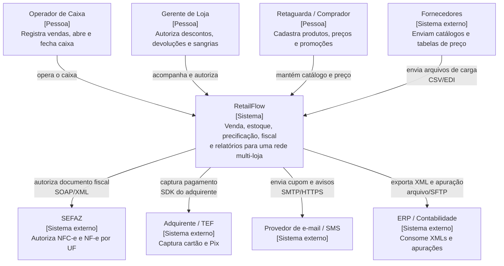
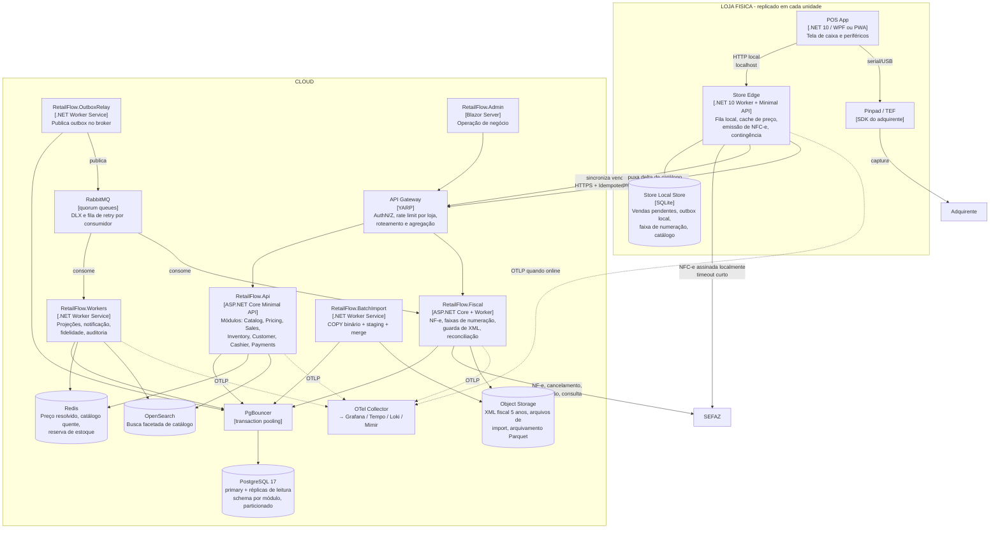
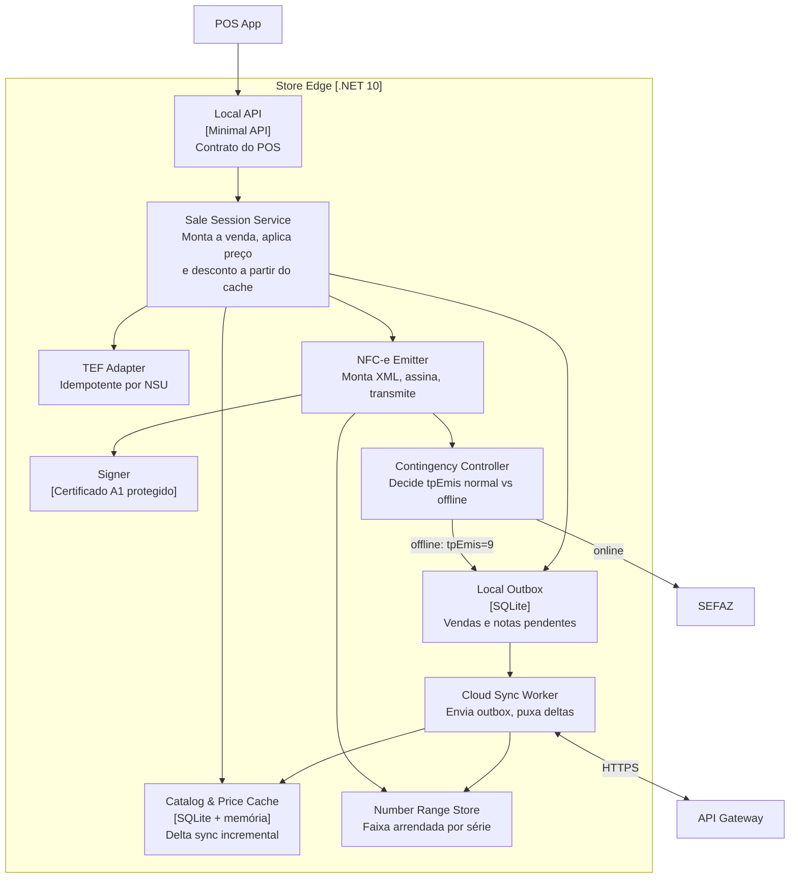
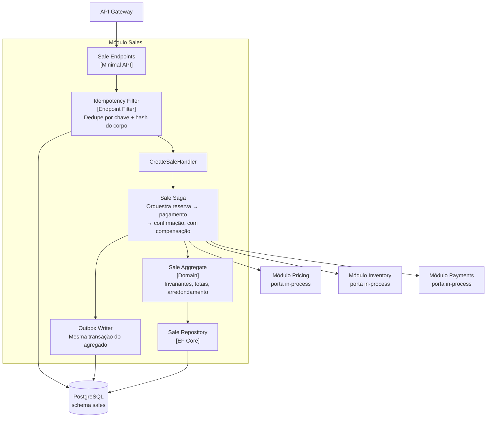
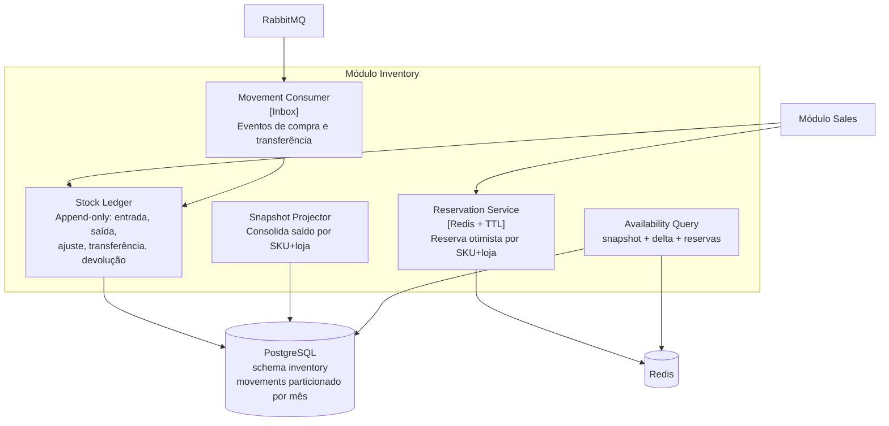
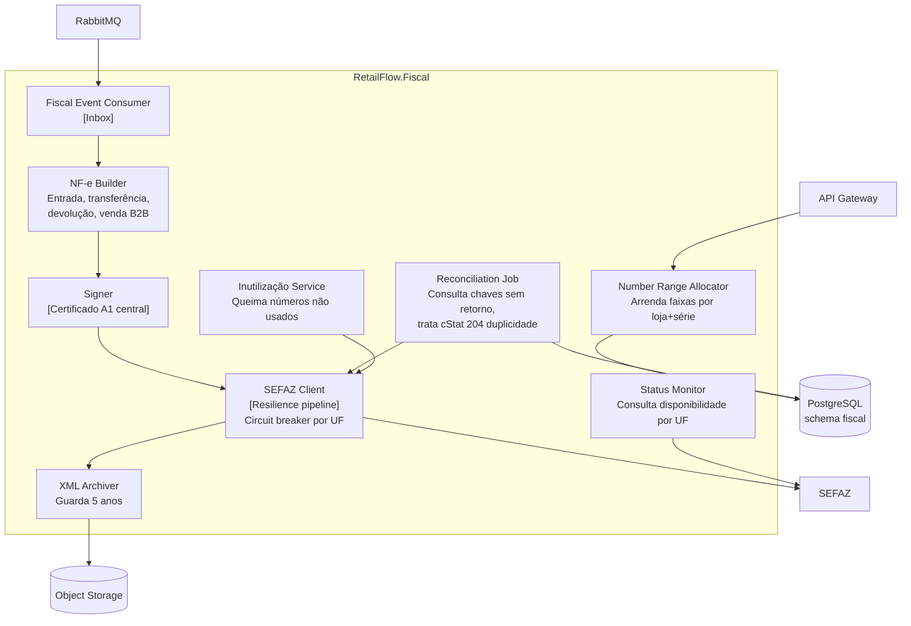
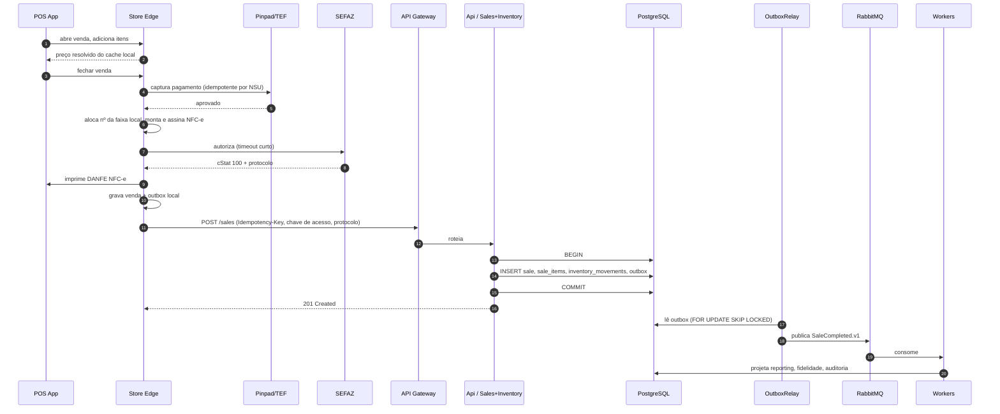
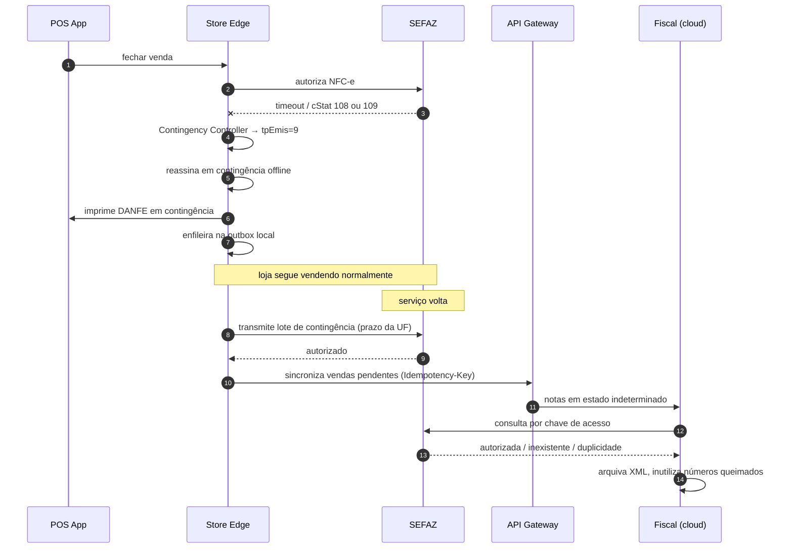
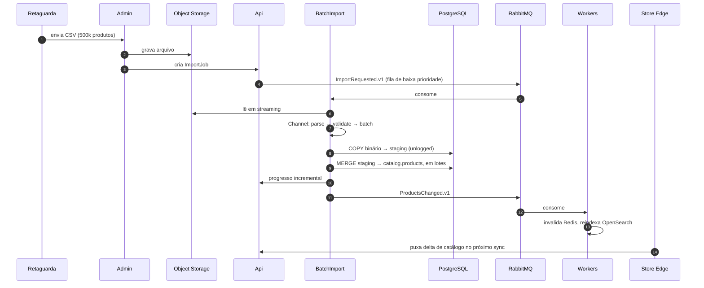
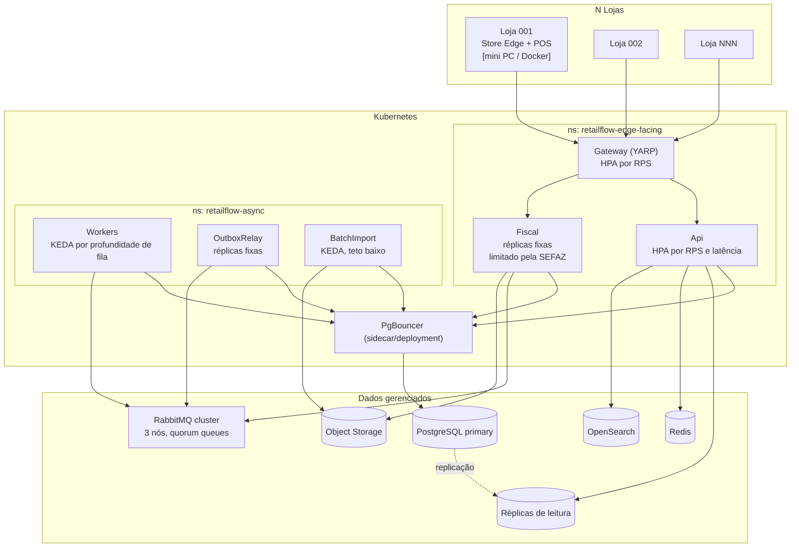

# RetailFlow — Arquitetura (Modelo C4)

> ## ⚠️ Documento superado em parte — leia o [ADR-0020](../ADRs/ADR-0020-escopo-pdv-multi-erp.md)
>
> Este documento foi escrito assumindo que o RetailFlow seria dono de catálogo, preço e
> estoque. **Não é.** O escopo real é um **PDV que se integra ao ERP do cliente**, vendido
> como produto de mercado para vários ERPs.
>
> O que continua válido: Store Edge, fiscal, caixa, devolução, saga, idempotência,
> observabilidade e PgBouncer. O que não vale mais: Catalog, Pricing e Inventory como
> contextos donos, Reporting e OpenSearch.
>
> **Diagrama atual:** [../../retail-flow.drawio](../../retail-flow.drawio)

> **Status:** parcialmente superado pelo ADR-0020
> **Data:** 2026-09-30
> **Premissas travadas:** rede única multi-loja · PDV com venda offline obrigatória · sem Event Sourcing no core

Este documento descreve a arquitetura do RetailFlow nos níveis 1 a 3 do modelo C4, mais
diagramas dinâmicos dos fluxos críticos e a visão de implantação. Cada elemento traz um
**Por quê** curto; o raciocínio completo, as alternativas descartadas e as consequências
negativas de cada escolha estão nos [ADRs](../ADRs/README.md).

---

## Sumário

- [Premissas e restrições](#premissas-e-restrições)
- [Nível 1 — Contexto](#nível-1--contexto)
- [Nível 2 — Containers](#nível-2--containers)
- [Nível 3 — Componentes](#nível-3--componentes)
  - [Store Edge](#l3-store-edge)
  - [Módulo Sales](#l3-módulo-sales)
  - [Módulo Inventory](#l3-módulo-inventory)
  - [Serviço Fiscal (cloud)](#l3-serviço-fiscal-cloud)
- [Diagramas dinâmicos](#diagramas-dinâmicos)
- [Implantação](#implantação)
- [Onde a escala realmente aperta](#onde-a-escala-realmente-aperta)
- [O que ficou de fora de propósito](#o-que-ficou-de-fora-de-propósito)

---

## Premissas e restrições

> **`P` = Premissa** — uma decisão do negócio. Pode ser revisitada, e revisitá-la muda a
> arquitetura.
> **`R` = Restrição** — um fato do mundo que não se negocia. Só resta projetar em volta.

| # | Premissa (P) / Restrição (R) | Consequência arquitetural |
|---|---|---|
| P1 | A loja precisa vender com o link caído | Existe um container **Store Edge** na loja. A NFC-e é emitida e assinada **localmente**. Numeração fiscal é pré-alocada em faixas. |
| P2 | Sem Event Sourcing | Estado atual no PostgreSQL. Eventos são de **integração**, publicados via Outbox. RabbitMQ resolve sozinho — sem Kafka. |
| P3 | Rede única, N lojas | Sem isolamento de tenant no schema. `TenantId` existe no SharedKernel como campo dormente. `StoreId` é a chave de partição lógica de tudo. |
| P4 | Milhões de SKUs, alta concorrência de venda | Busca de catálogo fora do Postgres. Estoque como ledger append-only. Particionamento temporal desde o schema inicial. |
| R1 | SEFAZ é lento, instável e tem limite de taxa | Nunca no caminho síncrono da cloud. Contingência é modo de operação, não tratamento de exceção. |
| R2 | XML fiscal precisa ser guardado por 5 anos | Object storage com política de retenção, não coluna no banco. |

---

## Nível 1 — Contexto

**Por quê deste recorte.** Os cinco sistemas externos são os únicos que impõem restrição
real de desenho. SEFAZ e TEF ditam latência e modos de falha no caminho do cliente —
ambos são terceiros lentos que podem cair no meio de uma venda, e ambos exigem
idempotência própria. Fornecedores ditam o volume do import em massa. ERP e mensageria
são assíncronos e não influenciam o caminho crítico.

---

## Nível 2 — Containers

### Por quê de cada container

**Store Edge** — é a consequência direta da premissa P1. Sem ele, link caído = loja parada.
Ele guarda a faixa de numeração fiscal arrendada da cloud, o certificado A1, o cache de
catálogo e preço, e uma outbox local. O POS nunca fala com a cloud diretamente: fala com o
Edge, que decide se está online ou não. Isso concentra toda a complexidade de
conectividade em um lugar só, em vez de espalhá-la por cada terminal.
→ [ADR-0005](../ADRs/ADR-0005-store-edge-operacao-offline.md)

**Emissão de NFC-e no Edge, não na cloud** — é o ponto que mais muda em relação ao desenho
original do README. A NFC-e precisa estar autorizada *antes* de imprimir o cupom, porque o
DANFE carrega o protocolo. Emitir da cloud adiciona um salto de rede e um modo de falha
num passo que tem cliente esperando no balcão. E a contingência offline exige assinar
localmente — se o link caiu, um serviço de assinatura na cloud também está inalcançável.
Logo, o certificado A1 vive na loja. Isso é um custo de segurança que aceitamos
conscientemente. → [ADR-0006](../ADRs/ADR-0006-fiscal-contexto-isolado.md)

**RetailFlow.Api como monólito modular** — sete módulos num processo só. Chamada entre
módulos é in-process, por interface pública explícita, validada por teste de arquitetura.
Não há ganho em pagar latência de rede e falha parcial entre Sales e Inventory antes de
existir tráfego. A extração vira serviço quando um módulo tiver perfil de escala ou de
falha diferente — e o desenho já deixa a costura pronta.
→ [ADR-0001](../ADRs/ADR-0001-modulos-por-contexto.md) · [ADR-0002](../ADRs/ADR-0002-quatro-deployables.md)

**RetailFlow.Fiscal separado desde o dia 0** — a única extração antecipada, e justificada:
ele é o único componente cujo tempo de resposta depende de um terceiro fora do nosso
controle, com limite de taxa por UF. Se ficasse dentro da Api, uma indisponibilidade da
SEFAZ prenderia threads e conexões de banco que a venda precisa. Na cloud ele cuida de
NF-e (entrada, transferência, devolução, B2B — ninguém esperando), arrendamento de faixas
de numeração, guarda de XML, reconciliação, cancelamento e inutilização.

**RetailFlow.OutboxRelay separado** — processo próprio, porque o relay tem um padrão de
acesso ao banco (polling com `FOR UPDATE SKIP LOCKED`) e um perfil de escala diferentes dos
da Api. Rodar dentro da Api significaria N réplicas competindo pela mesma tabela.
→ [ADR-0003](../ADRs/ADR-0003-outbox-inbox.md)

**PgBouncer entre tudo e o Postgres** — não é otimização, é requisito. Cada réplica da Api
abre seu próprio pool; dezenas de pods multiplicam por dezenas. Sem pooling externo em modo
transação, `max_connections` estoura muito antes da CPU do banco.
→ [ADR-0011](../ADRs/ADR-0011-pgbouncer-isolamento-pools.md)

**Redis com três papéis explícitos** — preço resolvido, catálogo quente e reserva de
estoque. Papel explícito importa: cache sem dono e sem invalidação por evento é a fonte
mais comum de bug de preço em varejo. → [ADR-0009](../ADRs/ADR-0009-pricing-contexto-cache.md)

**OpenSearch** — Postgres resolve *lookup* de SKU em milhões de linhas sem esforço. O que
ele não resolve é busca facetada com ranking sobre catálogo grande. São problemas
diferentes e o segundo justifica um segundo datastore.
→ [ADR-0012](../ADRs/ADR-0012-opensearch-busca-catalogo.md)

**Um só destino de telemetria** — tudo sai por OTLP para o Collector. O README tinha
Seq + Prometheus + Grafana + OTel, o que dá três UIs para investigar um incidente. Seq fica
só no compose de desenvolvimento. → [ADR-0013](../ADRs/ADR-0013-observabilidade-otlp.md)

**RetailFlow.Admin é operação de negócio** — progresso de import, notas rejeitadas pela
SEFAZ, lojas em contingência, divergência de estoque, fechamento de caixa. Monitoramento de
fila, status de worker e health check são Grafana e o Management UI do RabbitMQ; não
reconstruímos isso.

---

## Nível 3 — Componentes

### L3: Store Edge

**Contingency Controller** é o componente que define se a loja para ou não. Ele observa a
resposta da SEFAZ e decide o modo de emissão: `cStat 108` ou `109` (serviço paralisado),
erro de rede ou estouro do timeout curto disparam a troca para contingência offline
(`tpEmis=9`). O cupom sai assinado localmente, entra na outbox e é transmitido quando o
serviço volta, dentro do prazo da UF. A decisão é por tentativa, com histerese — não
oscila a cada requisição.

**Number Range Store** guarda faixas arrendadas da cloud (por exemplo, blocos de 1.000
números por série). Sem faixa pré-alocada não existe emissão offline, porque a numeração
precisa ser sequencial e sem colisão entre lojas. A cloud registra o que foi arrendado e
inutiliza depois os números queimados.

**Signer** guarda o certificado A1. É a concessão de segurança do desenho: certificado
replicado em N lojas. Mitigação em [ADR-0005](../ADRs/ADR-0005-store-edge-operacao-offline.md#segurança).

---

### L3: Módulo Sales

**Idempotency Filter antes de tudo.** Rede de loja é ruim; o Edge reenvia. A chave é
`Idempotency-Key` + hash do corpo, gravada numa tabela com TTL. Requisição repetida com o
mesmo corpo devolve a resposta original; mesma chave com corpo diferente é `409`. Sem
isso, um timeout vira venda duplicada, baixa de estoque duplicada e cupom duplicado.
→ [ADR-0004](../ADRs/ADR-0004-idempotencia-pdv.md)

**Outbox Writer na mesma transação do agregado.** `INSERT` em `sales`, `sale_items`,
`inventory_movements` e `outbox_messages` num único `COMMIT`. Não existe janela entre
persistir e publicar. → [ADR-0003](../ADRs/ADR-0003-outbox-inbox.md)

**Sale Saga com compensação.** Reserva de estoque tem TTL; pagamento pode falhar depois
dela; fiscal pode ser rejeitado depois do pagamento. Cada passo tem compensação explícita
(liberar reserva, estornar TEF, gerar nota de devolução).
→ [ADR-0016](../ADRs/ADR-0016-saga-venda-compensacao.md)

---

### L3: Módulo Inventory

**Ledger append-only em vez de `UPDATE stock SET qty = qty - 1`.** Esta é a resposta
direta ao requisito de concorrência. Um `UPDATE` na linha do SKU serializa todo mundo na
mesma linha — num SKU em promoção isso é o gargalo do sistema inteiro. Com `INSERT` de
movimentação não há contenção, e o saldo vem de um snapshot consolidado mais o delta desde
o snapshot. Bônus: auditabilidade completa de graça, que é exatamente o que inventário
precisa. → [ADR-0007](../ADRs/ADR-0007-estoque-ledger-append-only.md)

**Reserva no Redis com TTL.** Reserva é efêmera e de alta rotatividade — não merece uma
linha no Postgres. Se o processo morre, o TTL libera sozinho, sem job de limpeza.

---

### L3: Serviço Fiscal (cloud)

**Reconciliation Job é obrigatório, não opcional.** Quando um envio dá timeout, não
sabemos se a SEFAZ autorizou. Reenviar cegamente produz duplicidade (`cStat 204` /
`539`). O caminho correto é **consultar a chave de acesso antes de reemitir**. O job varre
documentos em estado indeterminado, consulta, e resolve: autorizado (arquiva), não
encontrado (reemite), duplicidade (recupera o protocolo existente).

**Circuit breaker por UF, não global.** SEFAZ do Paraná fora não pode derrubar a emissão
em São Paulo. Estado de resiliência particionado por UF.

---

## Diagramas dinâmicos

### D1 — Venda no caixa, caminho normal

O ponto a validar aqui: **o cliente vai embora no passo 9**. Tudo depois disso é
assíncrono e pode falhar sem travar o caixa. A venda já é um fato consumado na loja antes
da cloud saber dela.

### D2 — SEFAZ indisponível: contingência e reconciliação

Este é o fluxo que separa um sistema de varejo de uma demonstração. Se ele não estiver
desenhado desde o começo, a loja para quando a SEFAZ cair — e ela cai.

### D3 — Import em massa de catálogo

**O import roda em pool de workers, fila e pool de conexões separados do caminho de
venda.** Isolamento por recurso, não só por fila: uma carga de 500k produtos não pode
consumir as conexões de banco que o caixa precisa.
→ [ADR-0011](../ADRs/ADR-0011-pgbouncer-isolamento-pools.md) · [ADR-0015](../ADRs/ADR-0015-import-copy-staging.md)

---

## Implantação

**Workers escalam por profundidade de fila (KEDA), não por CPU.** Um consumidor de fila
esperando I/O tem CPU baixa justamente quando mais precisa escalar; HPA por CPU reage
tarde ou não reage. **Fiscal tem réplicas fixas** porque o gargalo é o limite de taxa da
SEFAZ — escalar réplicas só produziria mais rejeição.

---

## Onde a escala realmente aperta

Os requisitos de "milhões de produtos" e "milhões de requisições" são problemas
diferentes e só um deles é difícil.

| Pressão | É problema? | Tratamento |
|---|---|---|
| 10M linhas em `catalog.products` | **Não.** Lookup por SKU com índice B-tree é sub-milissegundo. | Nenhum tratamento especial. |
| Busca facetada nesses 10M | **Sim.** `tsvector` não entrega ranking nem facetas em escala. | OpenSearch, alimentado por evento. |
| Resolução de preço (lista × loja × canal × cliente × promoção × vigência) | **Sim.** É o dado mais lido do sistema. | Contexto Pricing + Redis com invalidação por evento. Cache no Edge para o caixa. |
| `sale_items` crescendo | **Sim.** 500 lojas × 1.000 vendas/dia × 5 itens ≈ 900M linhas/ano. | Particionamento declarativo mensal via `pg_partman` + arquivamento em Parquet. |
| Conexões de banco | **Sim, é o primeiro teto.** Pods × pool estoura `max_connections` antes da CPU. | PgBouncer em transaction pooling, pools segregados por workload. |
| Contenção em SKU quente | **Sim, é o segundo teto.** | Ledger append-only + reserva em Redis. |
| SEFAZ no caminho da venda | **Sim, é o terceiro teto.** | Emissão local no Edge com timeout curto + contingência. |
| Import competindo com venda | **Sim.** | Fila, worker pool e pool de conexões separados, com teto de réplicas. |

A ordem dessa tabela é a ordem em que os problemas vão aparecer num teste de carga.

---

## O que ficou de fora de propósito

- **Kafka e Event Sourcing** — descartados pela premissa P2. RabbitMQ com quorum queues
  atende o padrão de uso (distribuição de trabalho), e o ledger de estoque já dá a
  auditabilidade onde ela importa. → [ADR-0008](../ADRs/ADR-0008-rabbitmq-sem-kafka.md)
- **Isolamento multi-tenant no schema** — premissa P3. Mas `TenantId` existe no
  SharedKernel desde o dia 0, dormente, para que virar SaaS seja migração e não reescrita.
  → [ADR-0014](../ADRs/ADR-0014-tenantid-dormente.md)
- **Seq em produção** — consolidado no OTLP. → [ADR-0013](../ADRs/ADR-0013-observabilidade-otlp.md)
- **Monitoramento de infra no Admin** — é Grafana e RabbitMQ Management UI.

### Pendências resolvidas

As quatro lacunas apontadas na primeira versão deste documento foram decididas:

1. **Devolução, troca e cancelamento** → três fluxos distintos, com `Return` como agregado
   próprio e troca como composição. [ADR-0017](../ADRs/ADR-0017-devolucao-troca-cancelamento.md)
2. **Gestão de caixa** → sessão obrigatória, venda sem sessão aberta é rejeitada pelo
   domínio, conferência cega por meio de pagamento.
   [ADR-0018](../ADRs/ADR-0018-sessao-de-caixa.md)
3. **Certificado A1** → provisionamento por enrollment com token de uso único, rotação com
   30 dias de sobreposição, inventário por loja.
   [ADR-0019](../ADRs/ADR-0019-ciclo-de-vida-certificado-a1.md)
4. **Prazos fiscais por UF** → configuração por UF, nunca constante no código. Incorporado
   ao [ADR-0006](../ADRs/ADR-0006-fiscal-contexto-isolado.md).

Schema inicial correspondente: [schema-v1.sql](schema-v1.sql).

### O que continua em aberto

- **Quarentena de devolução** ([ADR-0017](../ADRs/ADR-0017-devolucao-troca-cancelamento.md))
  introduz o conceito de **localização dentro da loja**, que o modelo de estoque do
  [ADR-0007](../ADRs/ADR-0007-estoque-ledger-append-only.md) ainda não tem. O schema já
  carrega `location`, mas a modelagem de localizações em si não foi feita.
- **Sistema operacional do hardware do Edge.** A proteção por DPAPI
  ([ADR-0019](../ADRs/ADR-0019-ciclo-de-vida-certificado-a1.md)) amarra ao Windows;
  suportar Linux exige outro mecanismo. Decidir junto com a escolha do hardware.
- **Build vs. buy do fiscal.** Um provedor de emissão removeria muita complexidade, mas
  não elimina Edge nem contingência. Merece avaliação própria antes de escrever o
  emissor.
